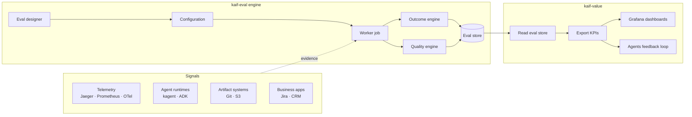
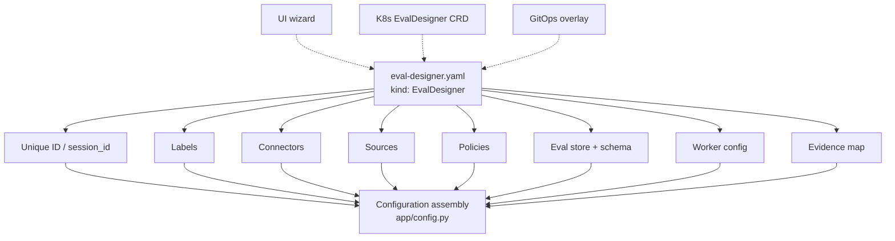
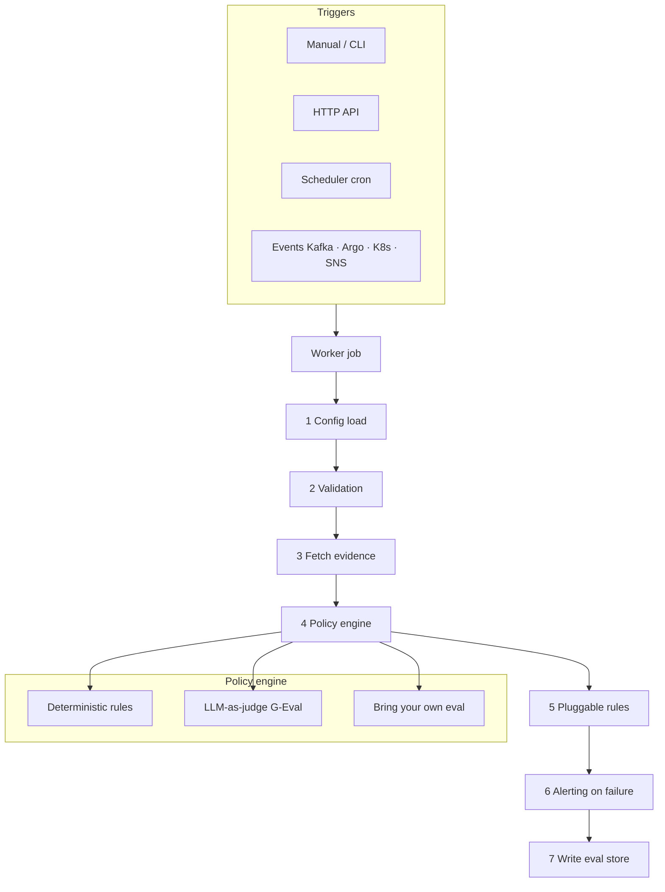
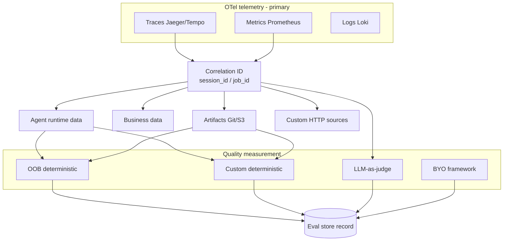

# kaif-eval diagrams (Mermaid preview)

Use this file if Excalidraw files do not open. Open markdown preview: **Cmd+Shift+V** (Mac) / **Ctrl+Shift+V** (Windows).

---

## 1. kaif-eval overview

---

## 2. Eval designer (mother file)

---

## 3. Worker job

---

## 4. Correlation engine

