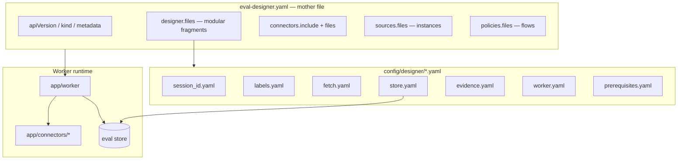

# Eval designer — mother composition file

**Version:** 0.1.0 (MVP)  
**Future surfaces:** UI wizard · `EvalDesigner` Kubernetes CRD (`apiVersion: kaif.dev/v1alpha1`)

The eval designer is the single composition root. Everything the worker needs — correlation id, labels, connectors, sources, store schema, scheduling, and policies — is declared here and composed from modular YAML fragments.

## Composition model



## Mother file sections

| Section | Module | User provides |
|---------|--------|---------------|
| **metadata** | `eval-designer.yaml` | Designer name, namespace (CRD-ready) |
| **session_id** | `designer/session_id.yaml` | Unique id field, trace attributes, correlation header |
| **labels** | `designer/labels.yaml` | Label dimensions + which sources supply each |
| **fetch** | `designer/fetch.yaml` | Per-connector session_id binding |
| **connectors** | `connectors/*.yaml` | Which connector *types* to load (`include: [jaeger, prometheus]`) |
| **sources** | overlay `sources/files` | Named instances (URL, auth, params) |
| **store** | `designer/store.yaml` | Driver, connection, **schema file + column contract** |
| **evidence** | `designer/evidence.yaml` | Role → source name (traces, runtime, judge, …) |
| **worker** | `designer/worker.yaml` | Mode, poll cron, event/webhook/k8s triggers, retry |
| **policies** | overlay `policies/files` | Flow outcomes, quality, runtime tool mapping |
| **prerequisites** | `designer/prerequisites.yaml` | Platform requirements (OTel, sampling, correlation) |

## session_id (unique run id)

```yaml
session_id:
  name: session_id
  store_as: job_id
  trace:
    primary_attribute: gen_ai.conversation.id   # demo overlay
    inject:
      header: X-Kaif-Run-Id
      span_attribute: kaif.run_id
```

Caller mints one id per workflow execution. Worker never lists sessions — it fetches evidence for that id only.

## Store + schema (configurable)

```yaml
store:
  driver: postgres | sqlite
  connection:
    url: ${EVAL_STORE_URL}
    path: ${EVAL_STORE_PATH}
  schema:
    contract: kaif-value-v1
    table: jobs
    file: schema/jobs.sql          # DDL loaded at worker start
    columns: [...]                 # declarative contract for UI / CRD validation
```

`app/config.load_store_schema()` resolves `store.schema.file` relative to `designer_dir` or `config/`. Override DDL inline with `store.schema.ddl` for advanced deployments.

## Worker job configuration

```yaml
worker:
  mode: on_demand | scheduled | event
  poll:
    interval_s: 60        # scheduled loop
    cron: "*/5 * * * *"   # alternative to interval
  trigger:
    type: manual | webhook | event | kubernetes
    webhook:
      enabled: true
      path: /v1/eval/run
    event:
      source: cloudevents
      filter: type=agent.job.completed
    kubernetes:
      watch: Job          # future: watch agent Job CRs
  concurrency: 1
  retry:
    max_attempts: 3
    backoff_s: 30
  ingest:
    wait_s: 12            # trace backend ingest delay
    jaeger_retries: 6
```

**MVP:** `mode: on_demand` — CLI passes `--job-id`. Scheduled/event modes are declared in designer for CRD/UI parity; controller implementation is a follow-on.

## Policies

Flow policies define per-agent outcomes, quality rubrics, and `runtime` tool mapping (publish tool, pending tools, artifact field). See `demo/flows/architecture/policy.yaml`.

## Layering: template → overlay

```
config/eval-designer.yaml     # mother template (apiVersion, modules, connector schemas)
demo/eval.yaml                # include: ../config/eval-designer.yaml
demo/designer/*.yaml          # POC bindings (session_id, evidence, store, worker)
demo/sources/*.yaml           # concrete source instances
demo/flows/*/policy.yaml      # architecture policy
```

## CRD mapping (future)

| YAML field | CRD path |
|------------|----------|
| `apiVersion` | `apiVersion` |
| `kind: EvalDesigner` | `kind` |
| `metadata.name` | `metadata.name` |
| `designer.files` | inlined or `configMapRef` |
| `connectors.include` | `spec.connectors[]` |
| `sources.files` | `spec.sources[]` |
| `store` | `spec.store` |
| `worker` | `spec.worker` |
| `policies.files` | `spec.policies[]` |

A validating admission webhook can enforce: correlation configured, store schema contract matches `kaif-value-v1`, every policy source name exists in `sources`.

## Related

- [Product doc + connector roadmap](kaif-eval-product.md)
- [Eval DB schema](evaldbschema.txt)
- [GenAI trace fields](gen-ai-trace-eval.md)
