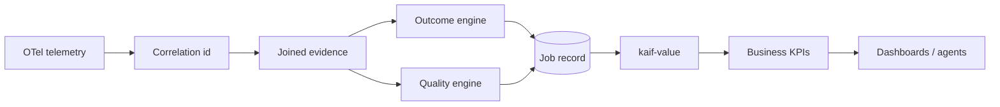
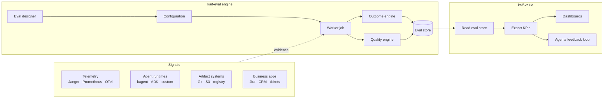
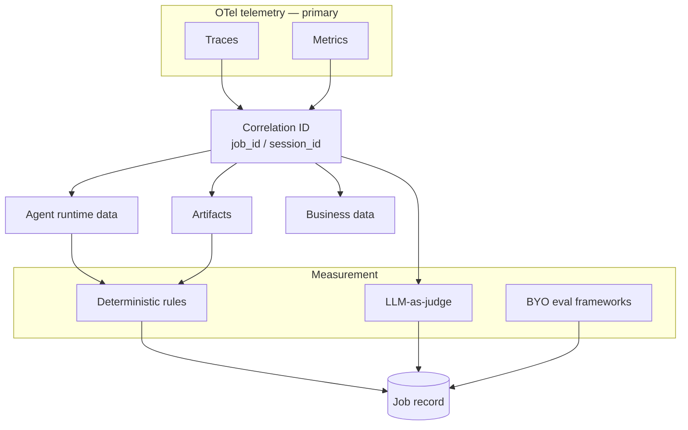

# kaif-eval: architecture design

**Audience:** general public (engineers and practitioners new to this system).  
**As of:** September 2026  
**Status:** Draft — architecture aligned to product end goals

kaif-eval is the measurement layer in KAIF (Kubernetes Agentic AI Fabric). It turns agent telemetry and related signals into **job records** that state whether work finished (**outcome**), how good it was (**quality**), and what it cost. A sibling product, **kaif-value**, reads those jobs and publishes **key performance indicators (KPIs)** to dashboards and other consumers. This document explains the end-to-end picture, the ideas you need before adopting it, and the main design choices—without assuming prior knowledge of any particular deployment.

## Contents

1. [Glossary](#glossary)
2. [Goals](#goals)
3. [Core concepts](#core-concepts)
4. [Prerequisites](#prerequisites)
5. [End-to-end architecture](#end-to-end-architecture)
6. [Correlation and measurement flow](#correlation-and-measurement-flow)
7. [Component explanations](#component-explanations)
8. [Key architectural challenges](#key-architectural-challenges)
9. [Key decisions](#key-decisions)
10. [Assumptions](#assumptions)
11. [Facts and references](#facts-and-references)
12. [Gaps, shortcomings, and open items](#gaps-shortcomings-and-open-items)
13. [Future roadmap](#future-roadmap)

## Glossary

| Term | Plain-language meaning |
|------|------------------------|
| KAIF | Kubernetes Agentic AI Fabric — a modular platform for designing, deploying, evaluating, and reporting on agents on Kubernetes. |
| kaif-eval | Evaluation product: fetches evidence, applies policy, writes the eval store. |
| kaif-value | Reporting product: reads eval jobs, computes KPIs, exports HTTP JSON. It does not run evaluations. |
| OpenTelemetry (OTel) | CNCF-graduated standard for traces, metrics, and logs from distributed systems. |
| Telemetry | OTel traces and metrics (and eventually logs) emitted by agents, gateways, and tools. |
| Signal | Any read-only evidence of work that already happened: telemetry, runtime sessions, artifacts, business apps. |
| Connector | Plugin for one *class* of system (traces, metrics, Git, agent runtime, HTTP). A vendor is a *binding* of that class. |
| Source | Named instance of a connector (URL, credentials, parameters). Policy references source *names*, not vendor SDKs. |
| Eval designer | Composition root where operators declare session id rules, labels, connectors, sources, store schema, worker behaviour, and policies. |
| Eval policy | Outcome and quality rules, scoped globally, per workflow, or per agent (more specific wins). |
| Job / session id | One unique identifier per agent run; the unit of evaluation. |
| Outcome | Whether the business task completed: **success**, **failed**, or **pending** (waiting on a person). |
| Quality | How good the work was: weighted deterministic checks plus optional LLM-as-judge scoring. |
| Deterministic check | A quality rule that does not call a judge model (for example: a publish tool appeared in traces). |
| LLM as judge | A separate model scores output or a trajectory against a rubric (for example via DeepEval G-Eval). |
| Eval store | Jobs ledger: one row per evaluated run. kaif-eval writes; kaif-value reads. |
| Label | A named dimension on a job (flow, scenario, agent, skill) used to slice KPIs. |
| KPI | Key performance indicator — a metric derived from many jobs (success rate, average quality, cost per outcome). |
| Worker job | A single execution that loads configuration, fetches evidence for one job id, measures, and writes the store. |
| HITL | Human in the loop — the agent paused for user input. Often reflected as **pending** outcome. |
| CRD | Custom Resource Definition — Kubernetes extension type; eval designer may be published as an `EvalDesigner` CRD. |

## Goals

1. **One measurement product, many backends.** Teams should not lock eval to one observability vendor or embed a judge library in every agent runtime. Connectors and named sources are the product surface; Jaeger, Prometheus, Git hosts, and kagent are examples of bindings—not the core.

2. **Telemetry becomes business truth.** Raw traces and metrics show *what happened*. kaif-eval converts that evidence, together with artifacts and runtime state, into **outcome** and **quality** on a stable job record that finance and product can trust.

3. **Outcome and quality stay separate, then stored together.** “Did it ship?” and “was it good?” are different questions. Both answers, plus spend and duration, live on the same job so reporting does not re-query trace backends.

4. **Declare measurement; do not fork the engine.** Sources, labels, and rules are configuration (YAML today, UI or CRD tomorrow). A new Git host or trace store is a binding change, not an engine rewrite.

5. **kaif-eval writes; kaif-value reports.** The eval store is the contract between measurement and dashboards. kaif-eval does not own Grafana. kaif-value does not scrape Jaeger or Git.

6. **One job id per run.** Evaluation is always scoped to a single correlation id. The system does not list or discover sessions; callers supply the id when work starts or when eval is triggered.

## Core concepts

### From telemetry to business KPIs

Agent platforms generate rich **telemetry**: span trees for LLM calls and tools, token and latency metrics, error rates. That data is essential for debugging and capacity planning, but it is a poor direct input for executive or product KPIs.

kaif-eval sits in the middle of a deliberate pipeline:

| Stage | What it is | Example |
|-------|------------|---------|
| Telemetry | Raw traces and metrics | Tool spans, token usage, model latency |
| Correlation | Same id on all signals for one run | `gen_ai.conversation.id` or `X-Kaif-Run-Id` |
| Evidence | Normalized facts from connectors | “publish tool called”, “artifact SHA”, “blocked on user” |
| Outcome | Business completion class | success / failed / pending |
| Quality | Weighted score and rule breakdown | 55% deterministic; G-Eval when success |
| Job record | One row in the eval store | outcome, quality, labels, spend, duration |
| KPI | Aggregate over many jobs | “Architecture flow success rate this week” |

**Opinion:** Dashboards should consume **jobs**, not raw Jaeger queries. That keeps KPI definitions stable when trace schemas or vendors change.

### Job-id-driven execution

Every evaluation run processes **exactly one** job id (also called session id or run id):

1. **Mint** — The caller (gateway, CI job, harness, or scheduler) creates a unique id before or at the start of agent work.
2. **Propagate** — The id is attached to HTTP headers (for example `X-Kaif-Run-Id`) and to span attributes (for example `gen_ai.conversation.id`, `kaif.run_id`) so telemetry and downstream systems share it.
3. **Evaluate** — A worker job receives that id (CLI, API, schedule, or event). It loads policy, fetches evidence **only for that id**, measures outcome and quality, writes one store row.
4. **Report** — kaif-value aggregates rows into KPIs; dashboards never need to know how traces were stored.

The worker does **not** scan all sessions in Jaeger or list agent conversations. That keeps eval predictable, cheap, and safe in multi-tenant environments.

How propagation is achieved (declared in eval designer, not hardcoded in the engine):

| Mechanism | Role |
|-----------|------|
| HTTP header on ingress | Gateways and clients stamp the run id before the agent sees the request |
| Span attributes | OTel instrumentation copies the id onto LLM and tool spans |
| Runtime APIs | Optional agent-framework connectors corroborate session state with the same id |
| Artifact metadata | Git commits or object metadata may reference the run id (binding-specific) |

### Importance of labels

Labels are structured metadata on each job: dimensions such as **flow**, **scenario**, **agent**, and **skill**. They are configured in eval designer—both the list of dimensions and which sources supply each value at eval time.

Labels matter because KPIs are rarely global averages. Product and platform teams need to ask:

- What is the success rate for the **architecture** flow vs **support** flow?
- Which **agent** version regressed **quality** after a prompt change?
- What is **cost per successful outcome** for **new_architecture** scenarios?

kaif-value uses labels to filter and group jobs. Without labels, the eval store would be a flat log of runs with no taxonomy. With labels, the same job record supports executive roll-ups and team-level drill-downs.

Labels are populated from declared sources (for example trace attributes, runtime session fields, or static policy context)—not by editing code in the measurement engine.

## Prerequisites

Before kaif-eval can produce trustworthy jobs, the platform must satisfy:

| # | Prerequisite | Why it matters |
|---|--------------|----------------|
| 1 | **Observability stack** — OTel Collector exporting traces and metrics to queryable backends (for example Jaeger, Prometheus) | Telemetry is the primary evidence plane |
| 2 | **Sufficient trace sampling** for eval — in early environments, full sampling is recommended so tool and publish spans are not dropped | Partial sampling can hide outcome signals |
| 3 | **GenAI span conventions** — conversation or task ids on spans (`gen_ai.conversation.id` and related attributes per [OpenTelemetry GenAI semantic conventions](https://opentelemetry.io/docs/specs/semconv/gen-ai/)) | Trace queries key off stable attributes |
| 4 | **Correlation contract** — one unique id per business run, documented in eval designer and enforced at ingress | Without it, evidence cannot be joined |
| 5 | **Eval store** — PostgreSQL or SQLite (or equivalent) with a schema contract shared with kaif-value | Measurement and reporting need a stable ledger |
| 6 | **Policy and sources configured** — eval designer binds connectors to named sources and attaches flow/agent policies | The engine is generic; configuration defines behaviour |

**Opinion:** Treat prerequisites as part of the product boundary. kaif-eval should validate them at worker start and fail with a clear status rather than silently producing empty or misleading jobs.

## End-to-end architecture

Read left to right: **signals** (work that already happened) feed the **kaif-eval engine**; results land in the **eval store**; **kaif-value** exports KPIs to **dashboards** and other consumers.

Triggers for the worker (manual CLI/API, scheduler, events) are configuration on eval designer; they all converge on the same pipeline for a single job id.

## Correlation and measurement flow

Telemetry is necessary but not sufficient. kaif-eval uses a **correlation id** to join traces with runtime sessions, published artifacts, and (where configured) business systems.

The **eval designer** declares which sources supply traces, runtime, artifacts, and judge backends. The **policy** declares how evidence maps to outcome and quality rules (including which tool names mean “published” or “waiting on user”).

## Component explanations

### Signals

Read-only evidence: telemetry (behaviour, cost), runtimes (session state), artifacts (published output), business apps (tickets, approvals). Signals never write the eval store.

### Eval designer and configuration

The composition root: id rules, labels, connectors, sources, store schema, worker triggers, evidence mapping, policies. Surfaces: YAML, future UI, Kubernetes CRD. **Configuration** is merged at runtime from designer fragments—it is data, not a separate service.

### Worker job

For **one** job id: validate prerequisites → fetch evidence → outcome engine → quality engine → write store. Triggers (CLI, API, schedule, events) are designer-declared.

### Connector plane

Protocol adapters return normalized records for a correlation id. Policies name **sources**, not vendors.

### Outcome and quality engines

**Outcome:** success / failed / pending from declarative rules. **Quality:** weighted deterministic checks, optional LLM-as-judge or BYO frameworks; judge may be skipped when outcome ≠ success.

### Eval store, kaif-value, dashboards

**Eval store:** one row per job (outcome, quality, labels, spend, duration). **kaif-value:** aggregates jobs to KPIs over HTTP JSON. **Dashboards / agents:** consume KPIs only.

## Key architectural challenges

| Challenge | Typical mistake | Design response |
|-----------|-----------------|-----------------|
| Telemetry ≠ “done” | Treating a clean trace as success | Outcome uses multiple sources; artifact publish is first-class |
| One run, many backends | Joining by time window or agent name | Require correlation id on every signal path |
| Eval coupling | Judge library inside the agent, or eval locked to one APM UI | kaif-eval beside runtimes: connectors read; judge backends plug in |
| One number for everything | Mixing completion and quality in a single score | Two engines, one job record |
| Vendor churn | Hardcoding Jaeger, Gitea, or kagent in engines | Connector type + named source; vendors are bindings |
| Data fatigue | Raw trace dashboards as “eval” | Jobs + labels → KPIs via kaif-value |

## Key decisions

| Decision | Chosen | Rejected | Why | Evidence |
|----------|--------|----------|-----|----------|
| Attachment model | Connector + named source | Vendor modules in engines | Additive bindings; engines stay blind to vendors | Product architecture |
| Write vs read path | kaif-eval writes store; kaif-value reads | Dashboards query traces directly | Stable KPI contract | Fact: kaif-value read-side design — https://github.com/aiverse-brnavneet-in/kaif-value (as of September 2026) |
| Evaluation unit | One worker run per job id | Session discovery / scan | Predictable cost and tenancy | Product architecture |
| Quality ordering | Deterministic first, judge second | Judge-only eval | Auditable cheap checks; judges cost tokens | Fact: DeepEval observability vs evaluation split — https://deepeval.com/docs/introduction (as of September 2026) |
| Policy shape | Hierarchical: agent → workflow → global | Per-agent code forks | Shared defaults, local overrides | Product architecture |
| Designer surfaces | YAML mother file + future CRD/UI | Code-only configuration | GitOps and Kubernetes-native operations | Product architecture |
| Trace evidence | Query trace backends via connector | Parse raw OTLP inside kaif-eval | Reuse existing observability investments | Fact: OTel graduated CNCF — https://www.cncf.io/projects/opentelemetry/ (as of September 2026) |

## Assumptions

1. **A correlation id can be propagated across telemetry, runtime, and artifact systems for a given deployment.** Prove by documenting the id in eval designer and showing the same value on spans and at least one non-trace source.

2. **Trace spans expose enough structure** (tool names, GenAI attributes, token usage) to drive deterministic outcome and quality rules without always opening artifact content.

3. **The job record shape** (outcome, quality, labels, spend, duration, evaluation JSON) is sufficient for kaif-value to publish the KPI catalogue product owners need.

4. **Label dimensions configured in eval designer** cover the taxonomy the organization uses for agents (flow, scenario, agent, skill or equivalents).

5. **Judge cost** remains acceptable when LLM-as-judge runs only on successful outcomes and a bounded rubric—otherwise operators will run deterministic-only policies.

## Facts and references

1. **Fact:** OpenTelemetry is a CNCF graduated project (graduated May 2026). — https://www.cncf.io/projects/opentelemetry/ (as of September 2026)

2. **Fact:** Prometheus is a CNCF graduated project with an HTTP query API. — https://www.cncf.io/projects/prometheus/ and https://prometheus.io/docs/prometheus/latest/querying/api/ (as of September 2026)

3. **Fact:** kagent is a CNCF sandbox project for Kubernetes-native AI agents (accepted 22 May 2025). — https://www.cncf.io/projects/kagent/ (as of September 2026)

4. **Fact:** OpenTelemetry documents GenAI semantic conventions for LLM and agent spans. — https://opentelemetry.io/docs/specs/semconv/gen-ai/ (as of September 2026)

5. **Fact:** DeepEval is an open-source framework supporting LLM-as-judge and agent metrics. — https://deepeval.com/docs/metrics-introduction (as of September 2026)

6. **Fact:** Langfuse can ingest OpenTelemetry traces via OTLP — useful as an alternate traces binding. — https://langfuse.com/integrations/native/opentelemetry (as of September 2026)

7. **Fact:** kaif-value is a read-side KPI service; kaif-eval produces the jobs it consumes. — https://github.com/aiverse-brnavneet-in/kaif-value (as of September 2026)

## Gaps, shortcomings, and open items

| Item | Type | Why it matters | What would close it |
|------|------|----------------|---------------------|
| Correlation across all bindings | Open | Join breaks if one backend drops the id | Published correlation contract + conformance tests per connector |
| Connector SDK | Gap | Retries, secrets, and health checks not fully standardized | Public connector interface spec |
| Enterprise signals | Gap | Jira, ServiceNow, Slack not in core catalogue yet | Additional connector bindings |
| Judge portability | Open | Quality spec maps cleanly to one judge backend first | Second backend running the same policy document |
| Store schema versioning | Open | kaif-value breaks if fields change silently | Version field and compatibility tests |
| Event-driven workers | Gap | Designer declares triggers; controllers still maturing | Scheduler and event controller implementations |
| Design-time eval | Gap | KAIF charter includes build/design surfaces | Policies reusing the same store and labels |
| Secrets management | Gap | Connectors need credentials | Workload identity; no secrets in policy Git |

## Future roadmap

| Phase | Intent | Depends on | Evidence of done |
|-------|--------|------------|------------------|
| Near | Harden correlation contract; expand connector catalogue (second Git host, alternate trace backend) | Connector SDK; documented session id | New binding without engine code change |
| Next | HTTP API and scheduled workers; richer judge metrics; second workflow under same designer | Worker controller; judge portability | Two flows, one KPI export |
| Later | EvalDesigner CRD and UI; event triggers (Kafka, SNS, Kubernetes); BYO eval frameworks; business-app connectors | CRD admission; schema versioning | GitOps-applied designer; jobs still feed kaif-value |

**Opinion:** Prioritize a stable **job record + labels + correlation id** contract. Everything else—connectors, triggers, judge backends—should extend that core without changing how dashboards consume value.
