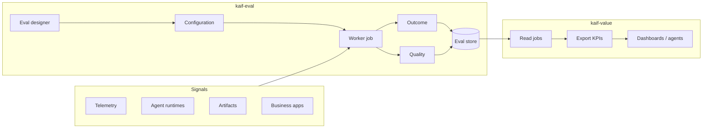

# kaif-eval — Product document

**Audience:** product owners, architects, platform engineers  
**Status:** Draft — architecture aligned to product end goals  
**As of:** September 2026  
**Related:** [architecture design](kaif-eval-architecture-design.md) · [eval designer](eval-designer.md) · [diagrams](diagrams/README.md) · [eval store contract](evaldbschema.txt)

---

## 1. End goal (north star)

**Every agent run that matters to the business must be measurable as a single job record: did it finish (outcome), was the work good (quality), what did it cost (spend), and how can we report value (KPIs).**

kaif-eval is the **measurement product** in [KAIF](https://github.com/aiverse-brnavneet-in/kaif-value) (Kubernetes Agentic AI Fabric). It:

1. Reads **signals** where agent work already lands (telemetry, runtimes, artifacts, business systems).
2. Joins them on a **correlation id** (one session / job per run).
3. Applies **declared policy** (outcome + quality rules).
4. Writes one row to the **eval store**.
5. Hands off to **kaif-value** for KPI export and dashboards.

kaif-eval does **not** own Grafana, does **not** replace observability backends, and does **not** embed eval libraries inside every agent.

*Diagram source: [01-kaif-eval-overview.excalidraw](diagrams/01-kaif-eval-overview.excalidraw)*

---

## 2. Why kaif-eval

### 2.1 Agentic systems produce telemetry — not business answers

Modern agent stacks are built on **OpenTelemetry**: traces, metrics, and (eventually) logs from LLM gateways, tool calls, and runtimes. Teams need high-fidelity telemetry so agents behave as expected — often with **full sampling** in lab and production pilots.

That creates **data fatigue**:

| You can see in telemetry | You still cannot answer |
|--------------------------|-------------------------|
| Token counts, latency, span trees | Did the agent **complete the business task**? |
| Tool invocations | Was the output **good enough** for the use case? |
| Cost per request | What is the **return on that spend**? |
| “Session ended” | Did it **ship an artifact**, **wait on a human**, or **fail silently**? |

Telemetry answers *what happened*. It does not, by itself, answer *whether the organization got value*.

### 2.2 The agent-eval landscape is fragmented and fast-moving

The eval space is large and evolving: LangSmith, Langfuse scores, DeepEval, Ragas, Phoenix, custom rubrics, runtime hooks in ADK/CrewAI/LangGraph, and vendor-specific “eval” tabs in observability products.

Teams face three pressures at once:

1. **Pick a stack** — but the agent runtime, trace backend, and judge framework may all change within a quarter.
2. **Embed vs observe** — libraries inside the agent couple eval to one framework; observability UIs couple eval to one vendor.
3. **Operate at scale** — ad-hoc scripts do not survive GitOps, multi-tenant clusters, or executive KPI reporting.

### 2.3 KAIF needs a stable measurement layer

KAIF modules cover design, deploy, eval, guard, value, and identity. **kaif-eval** owns the **eval spine**: one product that turns heterogeneous signals into **comparable job records** so **kaif-value** can publish KPIs without re-scraping Jaeger, Git, or agent APIs.

---

## 3. The gap

| Gap | Today (without kaif-eval) | Impact |
|-----|---------------------------|--------|
| **Telemetry ≠ outcome** | Dashboards show traces and cost; “success” is inferred manually or per-team | No consistent definition of done across agents and flows |
| **Telemetry ≠ quality** | Quality checks live in notebooks, CI one-offs, or a single vendor UI | Cannot compare agents, versions, or prompts over time |
| **Eval is coupled** | Judge code in the agent, or eval locked to one observability product | Every runtime or backend change forces a rewrite |
| **No business ledger** | Signals sit in Jaeger, Prometheus, Git, Jira — nowhere joins them per run | Finance and product cannot tie spend to outcome |
| **Configuration is code** | New Git host or trace backend = fork the measurer | Platform team becomes a bottleneck |

**Opinion:** The gap is not “lack of traces.” It is **lack of a configuration-driven product** that maps traces + artifacts + runtime state → **outcome + quality + spend** on a **per-job contract** that downstream reporting can trust.

---

## 4. How kaif-eval closes the gap

kaif-eval addresses three product gaps (from product context):

### 4.1 Telemetry → business outcome measurement

- **Primary data plane:** OTel traces and metrics (Jaeger, Prometheus in MVP; Tempo, Langfuse, enterprise APM on roadmap).
- **Correlation id** (`session_id` / `job_id`) joins telemetry with agent runtime data, published artifacts, and (later) business systems (Jira, ServiceNow, etc.).
- **Outcome engine** classifies each job: `success` · `pending` · `failed` (e.g. published to Git, blocked on user, ended without publish).
- **Quality engine** scores how good the work was: deterministic rules first, optional LLM-as-judge second.

*Diagram: [04-correlation-engine.excalidraw](diagrams/04-correlation-engine.excalidraw)*

### 4.2 Abstraction over tools, practices, and libraries

| Layer | Abstraction | Example |
|-------|-------------|---------|
| **Connector** | Protocol for a *class* of system | `jaeger`, `prometheus`, `gitea`, `api`, `llm` |
| **Source** | Named instance (URL, auth, params) | `jaeger-traces`, `judge-llm`, `git-artifacts` |
| **Policy** | Outcome + quality rules reference **source names**, not SDKs | `demo/flows/architecture/policy.yaml` |
| **Judge backend** | Pluggable behind quality engine | DeepEval G-Eval (MVP); Ragas, Phoenix, BYO HTTP (roadmap) |

Engines stay **vendor-blind**. Adding GitHub instead of Gitea is a **binding**, not an engine change.

### 4.3 Easy configuration and multiple surfaces

- **Eval designer** — mother composition file (`eval-designer.yaml` / future `EvalDesigner` CRD): session id, labels, connectors, sources, store schema, worker schedule, policies.
- **Surfaces:** YAML + GitOps (now) → UI wizard → Kubernetes operator (roadmap).
- **Worker jobs** — on-demand CLI/API (now) → scheduler and event triggers (Kafka, SNS, K8s events) on roadmap.
- **OOB + BYO eval** — deterministic rules and G-Eval out of the box; custom rules and bring-your-own frameworks without forking `app/`.

*Diagrams: [02-eval-designer.excalidraw](diagrams/02-eval-designer.excalidraw) · [03-worker-job.excalidraw](diagrams/03-worker-job.excalidraw)*

### 4.4 Write path vs read path (kaif-value)

| Product | Role |
|---------|------|
| **kaif-eval** | Measure one job; write eval store |
| **kaif-value** | Read jobs; compute and export KPIs to Grafana or other UIs |

This split keeps measurement logic out of dashboards and keeps reporting logic out of trace queries.

---

## 5. Product scope

### In scope

- Per-job evaluation (not session discovery / listing).
- Connector-driven evidence fetch.
- Declarative policy (outcome + quality + runtime tool mapping).
- Configurable eval store schema (contract with kaif-value).
- Labels for flow, scenario, agent, skill (extensible).
- Spend and duration on the job record.

### Out of scope (delegated)

| Concern | Owner |
|---------|--------|
| Cluster install, GitOps, CRD platform | kaif-platform |
| Agent authoring and runtime | kagent / ADK / other runtimes |
| Trace ingestion | OTel Collector, Jaeger, etc. |
| KPI definitions and HTTP export | kaif-value |
| Admission and runtime guardrails | kaif-guard |
| Dashboard rendering | Grafana / custom apps |

---

## 6. Personas

| Persona | Uses kaif-eval for |
|---------|-------------------|
| **Platform engineer** | Connectors, sources, prerequisites, deploy, store schema |
| **AI outcome lead** | Policy, quality rubrics, labels, KPI inputs via kaif-value |
| **Agent owner** | Flow/agent policy overrides, demo bindings, eval thresholds |
| **FinOps / PM** | Job spend fields and outcomes consumed through kaif-value |

---

## 7. Requirements

Requirements are derived from the **end goal** (§1). Priority: **P0** = MVP must have · **P1** = next phase · **P2** = roadmap.

### 7.1 Correlation and job model

| ID | Requirement | Priority | Rationale (end goal) |
|----|-------------|----------|----------------------|
| R-COR-01 | Caller mints one **unique id per agent run**; worker evaluates **that id only** | P0 | One business job per run |
| R-COR-02 | Id propagated via **trace attributes** and optional **HTTP header** (`X-Kaif-Run-Id`) | P0 | Join telemetry without listing sessions |
| R-COR-03 | Designer declares correlation contract (`session_id` block); not hardcoded in engine | P0 | Multi-tenant, multi-flow platform |
| R-COR-04 | Job record is immutable ledger row: outcome, quality, labels, spend, duration, evaluation JSON | P0 | kaif-value KPI contract |
| R-COR-05 | Labels dimensions configurable (flow, scenario, agent, skill) with source bindings | P0 | Slice KPIs by product taxonomy |

### 7.2 Evidence and connectors

| ID | Requirement | Priority | Rationale |
|----|-------------|----------|----------------------|
| R-CON-01 | **Connector** = protocol adapter; **source** = named configured instance | P0 | Abstraction over vendors |
| R-CON-02 | Policies reference **source names** only, never vendor SDKs | P0 | Portable policy |
| R-CON-03 | MVP connectors: **jaeger**, **prometheus**, **kagent**, **gitea**, **llm**, **api** | P0 | POC platform bindings |
| R-CON-04 | Fetch evidence per job from all sources declared in policy/designer | P0 | Multi-signal outcome |
| R-CON-05 | Roadmap connector families per product context (DB, object store, Jira, Slack, LangSmith, etc.) | P2 | Enterprise and eval-tool coverage |
| R-CON-06 | Generic **api** connector for custom HTTP evidence | P0 | Escape hatch without code fork |

### 7.3 Outcome measurement

| ID | Requirement | Priority | Rationale |
|----|-------------|----------|----------------------|
| R-OUT-01 | Classify each job: **success**, **failed**, **pending** | P0 | Business completion state |
| R-OUT-02 | Outcome rules defined in **policy YAML** per flow/agent | P0 | Declare, don’t code |
| R-OUT-03 | Support **trace-derived** outcome signals (tools, publish, HITL/pending) via configurable runtime mapping | P0 | Telemetry → outcome |
| R-OUT-04 | Support **artifact-derived** outcome (e.g. Git publish SHA) as first-class | P0 | “Done” = shipped work |
| R-OUT-05 | Agent-scoped policy overrides workflow overrides global (inheritance) | P1 | Shared defaults, local overrides |

### 7.4 Quality measurement

| ID | Requirement | Priority | Rationale |
|----|-------------|----------|----------------------|
| R-QUA-01 | **Deterministic** quality rules (weighted, auditable pass/fail per rule) | P0 | Cheap, explainable score |
| R-QUA-02 | **LLM-as-judge** (G-Eval / DeepEval) optional per policy section | P0 | Subjective quality when needed |
| R-QUA-03 | Judge may be **skipped** when outcome ≠ success (configurable `require_outcome`) | P0 | Don’t judge incomplete work |
| R-QUA-04 | Quality score and per-rule breakdown stored in job `evaluation` JSON | P0 | kaif-value drill-down |
| R-QUA-05 | **BYO eval framework** (Ragas, Phoenix, custom HTTP judge) pluggable behind quality engine | P1 | Abstraction over eval libraries |
| R-QUA-06 | Record **judge token spend** separately from agent spend | P0 | True cost of measurement |

### 7.5 Eval designer

| ID | Requirement | Priority | Rationale |
|----|-------------|----------|----------------------|
| R-DES-01 | **Mother file** composes: session_id, labels, connectors, sources, store, worker, policies, evidence | P0 | Single product surface |
| R-DES-02 | Template (`config/`) + overlay (`demo/` or tenant) via `include` | P0 | OOTB vs tenant bindings |
| R-DES-03 | **Store + schema** configurable (driver, DDL file, column contract `kaif-value-v1`) | P0 | Enterprise store choice |
| R-DES-04 | **Worker config** declarable: mode, triggers, retry, ingest wait | P0 | Same schema for CLI and future controller |
| R-DES-05 | CRD-ready shape (`apiVersion`, `kind: EvalDesigner`) | P1 | K8s-native operations |
| R-DES-06 | UI wizard for designer fields | P2 | Lower barrier for non-YAML users |

### 7.6 Worker job

| ID | Requirement | Priority | Rationale |
|----|-------------|----------|----------------------|
| R-WRK-01 | Pipeline: load config → validate → fetch → policy → write store | P0 | Reliable job execution |
| R-WRK-02 | **On-demand** execution with `--job-id` (CLI) | P0 | MVP demos and CI hooks |
| R-WRK-03 | Validation: source refs exist, schema contract, prerequisites (OTel, sampling) | P0 | Fail fast, operable |
| R-WRK-04 | **HTTP API** trigger (`POST /v1/eval/run`) | P1 | Integration with gateways |
| R-WRK-05 | **Scheduled** worker (cron / interval) | P1 | Batch re-eval, drift checks |
| R-WRK-06 | **Event-driven** triggers (Kafka, SNS, K8s events, Argo Events) | P2 | Real-time eval on completion |
| R-WRK-07 | Alerting on job failure (webhook, metrics) | P1 | Operability |

### 7.7 Eval store and kaif-value handoff

| ID | Requirement | Priority | Rationale |
|----|-------------|----------|----------------------|
| R-STR-01 | One **jobs** table row per evaluated `job_id` | P0 | Business ledger |
| R-STR-02 | Fields: `job_id`, `outcome`, `started_at`, `ended_at`, `labels`, `evaluation`, `spend_in_usd`, `time_taken_sec` | P0 | [evaldbschema.txt](evaldbschema.txt) |
| R-STR-03 | kaif-eval **writes**; kaif-value **reads** — no circular dependency | P0 | Clean module boundary |
| R-STR-04 | Schema versioning and compatibility tests with kaif-value | P1 | Safe evolution |

### 7.8 Platform prerequisites (non-functional)

| ID | Requirement | Priority | Rationale |
|----|-------------|----------|----------------------|
| R-PLT-01 | OTel Collector → trace + metrics backends deployed | P0 | Primary evidence |
| R-PLT-02 | **100% trace sampling** in lab/MVP environments | P0 | Avoid missing publish/HITL spans |
| R-PLT-03 | GenAI span attributes for conversation id and tool calls | P0 | Trace-only eval path |
| R-PLT-04 | Secrets via env / vault placeholders — never in Git policy | P0 | Security |
| R-PLT-05 | Deploy paths: local CLI, Docker, Helm | P0 | KAIF iteration evidence |

### 7.9 Operability and packaging

| ID | Requirement | Priority | Rationale |
|----|-------------|----------|----------------------|
| R-OPS-01 | `check_prereqs` script for observability + correlation | P0 | Demo reproducibility |
| R-OPS-02 | Unit tests without live cluster | P0 | CI for config engine |
| R-OPS-03 | End-to-end evidence: manifest → deploy → eval → store → KPI | P0 | KAIF definition of done |

---

## 8. MVP success criteria

MVP is **done** when all of the following are true on a **real Kubernetes cluster**:

| # | Criterion | Evidence |
|---|-----------|----------|
| 1 | Architecture flow runs end-to-end with minted `job_id` | `demo/flows/architecture/run-job.py` + worker CLI |
| 2 | **Pending** outcome from traces alone (HITL / `ask_user`) | Jaeger span tool mapping + policy `runtime` block |
| 3 | **Success** outcome when publish tool + artifact SHA present | Live run + store row |
| 4 | Deterministic quality score written with per-rule breakdown | `evaluation.sections.deterministic` in job row |
| 5 | G-Eval runs when outcome = success (optional section) | Judge connector + spend fields |
| 6 | kaif-value reads job and exports at least one KPI | Grafana or HTTP JSON |
| 7 | New source binding added via **config overlay only** (no engine edit) | Demo `eval.yaml` pattern |

**Current status (September 2026):** trace-only **pending** path validated; publish/success + G-Eval on live cluster remain open MVP items.

---

## 9. Roadmap summary

| Area | Now (MVP) | Next | Later |
|------|-----------|------|-------|
| **Connectors** | jaeger, prometheus, kagent, gitea, llm, api | postgres crawl, langfuse/langsmith | Jira, S3, Slack, ADK/CrewAI runtime APIs |
| **Designer** | YAML mother file + fragments | EvalDesigner CRD | UI wizard |
| **Worker** | On-demand CLI | HTTP API, scheduler | Kafka, SNS, K8s watch |
| **Eval** | Deterministic + DeepEval G-Eval | More judge metrics | BYO framework adapter |
| **Store** | SQLite / Postgres | Schema versioning | Multi-tenant isolation |

---

## 10. Related documents

| Document | Purpose |
|----------|---------|
| [kaif-eval-architecture-design.md](kaif-eval-architecture-design.md) | Public architecture design (ADD) |
| [eval-designer.md](eval-designer.md) | Mother file and CRD mapping |
| [gen-ai-trace-eval.md](gen-ai-trace-eval.md) | Span attributes for eval |
| [diagrams/README.md](diagrams/README.md) | Diagram PNG exports and Excalidraw sources |

---

## 11. Glossary (short)

| Term | Meaning |
|------|---------|
| **Job** | One evaluated agent run, keyed by `job_id` / `session_id` |
| **Outcome** | Business completion: success, failed, pending |
| **Quality** | How good the work was (deterministic + optional judge) |
| **Connector** | Protocol adapter type (jaeger, gitea, …) |
| **Source** | Named connector instance in config |
| **Eval designer** | Composition root for all worker configuration |
| **Eval store** | Jobs ledger written by kaif-eval, read by kaif-value |
